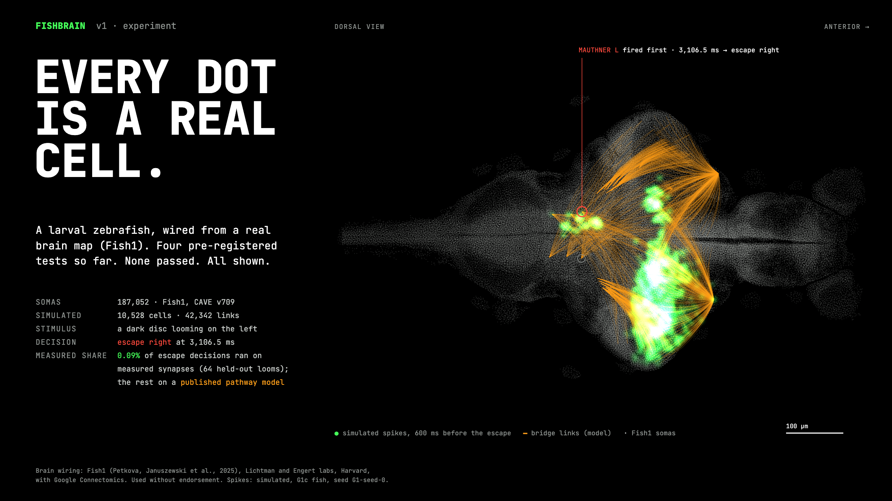
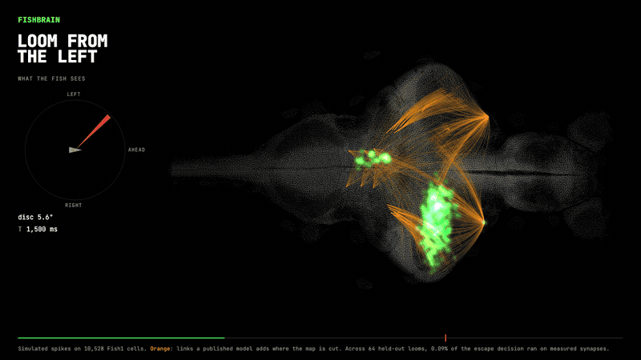
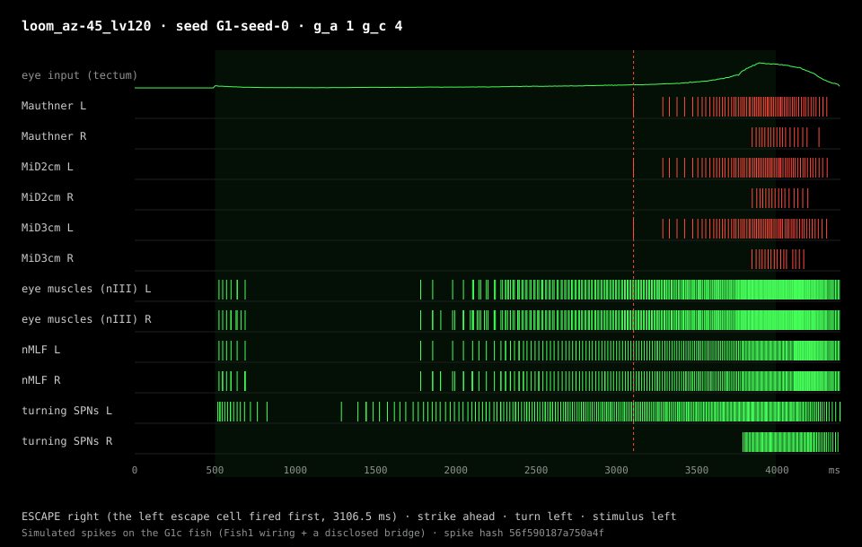
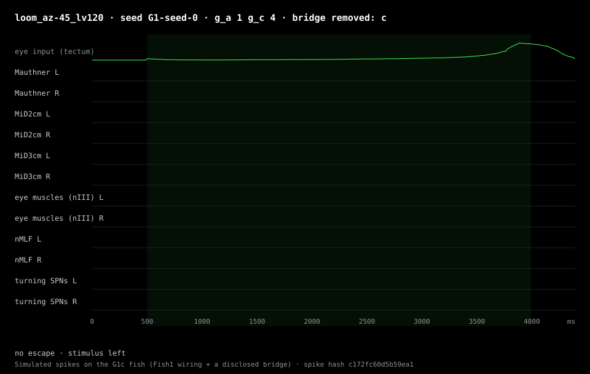
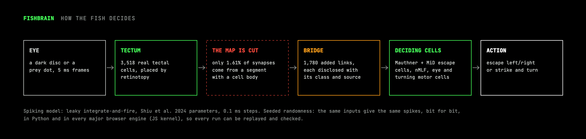
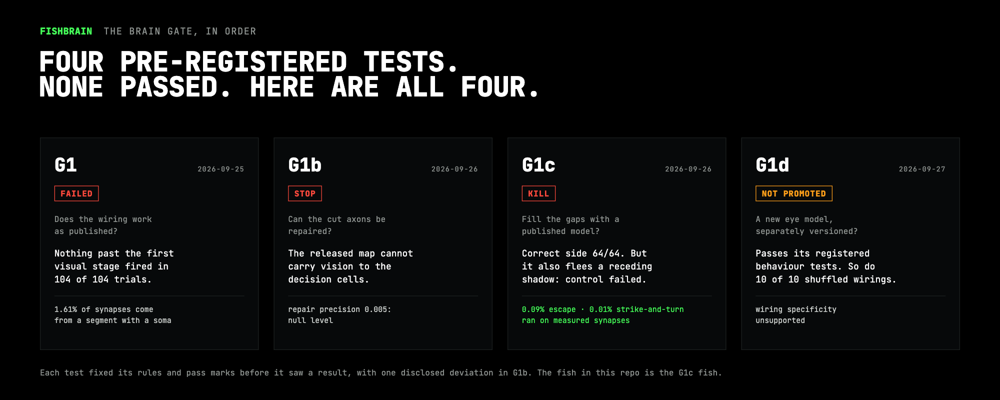
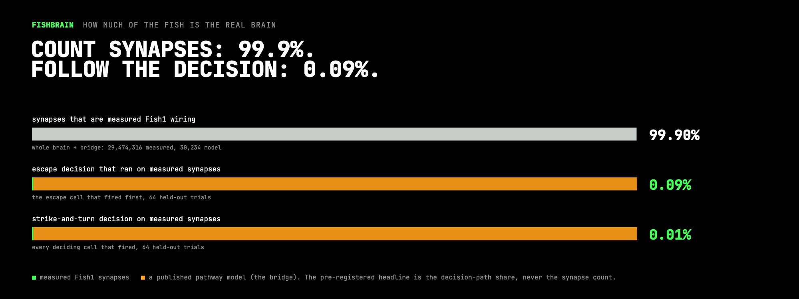

<p align="center">
  
</p>

# FISHBRAIN

A larval zebrafish run on the wiring map of a real zebrafish brain, as a spiking simulation anyone can replay bit
for bit. **v1 is an experiment.** It ships the engine, the fish, and every test so far. None has passed.

> **The line that goes with every claim here.** The anatomy is real: Fish1, 187,052 cells, 29,474,316 synapses. The
> public map is cut between the eye and the cells that decide, so a disclosed, published pathway model fills the gap.
> Across 64 held-out looms, **0.09%** of the escape decision ran on measured synapses. For strike-and-turn, **0.01%**.

## Watch one decision

<p align="center">
  
</p>

A dark disc looms on the fish's left. The left eye feeds the right tectum, which lights up. At 3,106.5 ms the left
Mauthner cell fires first and the fish bends right, away from the threat. Every dot is a real Fish1 cell. Green is
simulated spikes. Orange is where the model fills in.

## Check it yourself

About a minute on a laptop. No login, no 2.5 GB download: the demo needs only numpy and scipy.

```sh
git clone https://github.com/1stPercentile/fishbrain
cd fishbrain/brain
python3 -m venv .venv && . .venv/bin/activate
pip install -r requirements.txt
python -m fishbrain.demo
```

```text
loom_az-45_lv120  seed G1-seed-0  (1.8 s)
  ESCAPE right (the left escape cell fired first, 3106.5 ms) · strike ahead · turn left · stimulus left
  spike hash  56f590187a750a4ff9bbff152aa939b13ebd097fe5c62b2a1fd903aee122fd67
  published   56f590187a750a4ff9bbff152aa939b13ebd097fe5c62b2a1fd903aee122fd67  MATCH

prey_az+15_v60  seed G1-seed-0  (1.7 s)
  no escape · strike ahead · turn right · stimulus right
  spike hash  f1729839521d12a0cde358872eb1408418cf2fbca2974d5e22e0a3a9dbf09be2
  published   f1729839521d12a0cde358872eb1408418cf2fbca2974d5e22e0a3a9dbf09be2  MATCH

Both trials reproduce the published record bit for bit.
```

The demo rebuilds the fish the G1c gate tested from five sha256-pinned files in [brain/kit/](brain/kit/), checks
its network digest (`0b6f3369…`), reruns two held-out gate trials and compares each spike hash with the published
record in [evidence/data/g1c-data/gate/gate_results.json](evidence/data/g1c-data/gate/gate_results.json). Same wiring,
same inputs, same seed: the same spikes, down to the bit.

## Make your own fish

Every lever changes the fish, and the digests say exactly which fish you ran. Each run writes a spike raster (SVG)
and a receipt (JSON) to `brain/runs/`. Results below are seed `G1-seed-0`.

| run | what it changes | what the fish does |
|---|---|---|
| `python -m fishbrain.demo loom --az -45` | a dark disc looms on the left | escape right, 3,106.5 ms |
| `python -m fishbrain.demo loom --az 45` | the same, on the right | escape left, 3,368.7 ms |
| `python -m fishbrain.demo prey --az -15 --speed 60` | a small dot sweeps on the left | strike, turn left |
| `python -m fishbrain.demo recede --side left` | a disc that shrinks away, which a fish should ignore | **escape right, 1,518.7 ms: the control G1c failed** |
| `python -m fishbrain.demo loom --ablate c` | delete the model's literature pathways (bridge class c: the escape crossing and the prey relays) | **no escape; no deciding cell fires** |
| `python -m fishbrain.demo loom --ablate a` | delete the reattached fragments instead | escape right, unchanged |
| `python -m fishbrain.demo loom --lesion unilateral_left` | silence the left escape cells | the right one fires late (3,844.4 ms): the fish bends toward the threat |
| `python -m fishbrain.demo loom --g-c 8 --seed <anything>` | double the model's gain, choose your own seed | yours to find out |

<table>
  <tr>
    <td width="50%"></td>
    <td width="50%"></td>
  </tr>
  <tr>
    <td><b>The G1c fish.</b> The escape cells fire from 3,106.5 ms.</td>
    <td><b>Bridge class c removed.</b> The eye still sees the loom. Nothing downstream fires.</td>
  </tr>
</table>

That second raster is what 0.09% looks like. Found a fish worth showing? Post its raster and its spike hash: anyone
can rerun your command and get the same hash.

## How the fish decides

<p align="center"></p>

## The gate, in order

<p align="center"></p>

| test | asked | result | record |
|---|---|---|---|
| **G1** · 2026-09-25 | Does the wiring work as published? | **FAILED** | [G1-gate.md](evidence/G1-gate.md) |
| **G1b** · 2026-09-26 | Why? Can the cut axons be repaired? | **STOP** | [G1b-structure.md](evidence/G1b-structure.md), [G1b-repair-probe.md](evidence/G1b-repair-probe.md) |
| **G1c** · 2026-09-26 | Fill the gaps with a published model. How much still runs on real wiring? | **KILL** | [G1c-gate.md](evidence/G1c-gate.md) |
| **G1d** · 2026-09-27 | A separate eye model | **not promoted** | [G1d.md](evidence/G1d.md) (summary; full record next release) |

Every test fixed its rules and pass marks before it saw a result, with one disclosed deviation: a G1b readout rule
set aside after the data were seen ([G1b-readouts.md](evidence/G1b-readouts.md) s.4). Checks added after a result are
labelled post hoc. Start at [evidence/index.md](evidence/index.md).

## How much of the fish is the real brain

<p align="center"></p>

Count synapses and the fish is 99.9% Fish1. Follow the drive that actually made each decision and it is 0.09% for the
escape and 0.01% for strike-and-turn. The second number is the pre-registered headline, and it stays the headline.

## What's in here

| path | what |
|---|---|
| [brain/fishbrain/](brain/fishbrain/) | the engine. `sim.py`: leaky integrate-and-fire with Shiu et al. 2024 parameters, exact update, seeded PCG64 streams, hashes for wiring, parameters, spikes and state. `bridge.py`: the G1c fish. `provenance.py`: the decision-path share. `snapshot.py`: checkpoints and receipts. `pull.py`: the Fish1 download |
| [brain/js/](brain/js/) | `fishbrain-sim.mjs`, a bit-exact JavaScript port (checked in Node and Chromium; Firefox and WebKit untested), and `verify.mjs`, which replays a receipt in the browser and fails closed |
| [brain/kit/](brain/kit/) | the G1c fish in five pinned files |
| [brain/tests/](brain/tests/) | the test suite. From `brain/`: `python -m pytest tests`. The JavaScript tests (`test_js_parity.py`, `test_verify.py`) need Node.js on `PATH` (or `FISHBRAIN_NODE`) and fail, not skip, without it; tests that need the full Fish1 download are skipped by name ([rebuild_only.txt](brain/tests/rebuild_only.txt)) unless you pass `--rebuild` |
| [evidence/](evidence/) | the public record of every gate: notes, data, sha256 of every file |
| [assets/](assets/) | these images, drawn from the Fish1 soma table, the G1c fish's cells and three simulated gate trials whose spike hashes match the record |

### Rebuild it from the source data

```sh
pip install -r requirements-full.txt
python -m fishbrain.pull              # the public Fish1 wiring: about 2.5 GB, MD5-verified, no login
python -m fishbrain.bridge rederive   # rebuild every bridge list from its written rules; any mismatch stops the build
python -m fishbrain.bridge topology   # reduce the brain to the cells that can reach a decision
python -m fishbrain.bridge gate       # the G1c gate, end to end
```

## Next

- **A body.** A physics larva whose swim moves its eyes, closing the loop between what it sees and what it does.
- **A better map.** A synapse-resolution connectome of the ZAPBench specimen, a larva whose whole-brain activity was
  recorded, is described as upcoming (Lueckmann, Jain & Januszewski 2026). When it is released, the fish gets a new
  brain and the gate runs again.
- **The tank.** The same two decisions, pointed at a live market: a coin with buyers arriving swims in as prey, and a
  coin dumping looms. Paper only, until a brain passes its gate.

## Credits

Brain wiring: **Fish1**. Petkova, M. D., Januszewski, M., et al. (2025). *A connectomic resource for neural
cataloguing and circuit dissection of the larval zebrafish brain.* bioRxiv,
[doi:10.1101/2025.06.10.658982](https://www.biorxiv.org/content/10.1101/2025.06.10.658982v1). Released by the
Lichtman and Engert laboratories at Harvard University with the Connectomics team at Google. Used without endorsement.
Neuron model: Shiu et al. 2024, *Nature* 634:210.

Code: MIT. The Fish1 data and anything derived from it are not covered by that licence; see [LICENSE](LICENSE), [NOTICE](NOTICE) and
[evidence/G0-licence.md](evidence/G0-licence.md).
